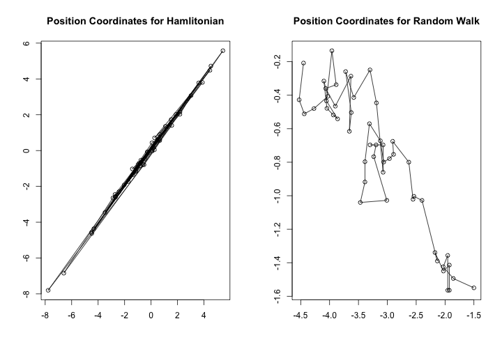

Homework 3 (due 24 Sep in class)
========================================================

#### Verify equation 2.10 in [Yu and Meng](http://jarad.me/stat615/papers/Yu_Meng_to_2011.pdf).

The algorithms iterates between drawing

$$
Y_{mis} | (\theta^t, Y_{obs}) \sim N(\frac{\theta^t + VY_{obs}}{1+V}, \frac{V}{1+V})
\\ \theta^{t+1} | Y_{mis}, Y_{obs} \sim N(Y_{mis}, V)
$$

Not that we can write $\theta^{t+1} = Y_{mis} + \epsilon$ where $\epsilon \sim N(0, V)$. Thus, it is easy to see why $\theta^{t+1}$ is normal with $E[\theta^{t+1}] = E[Y_{mis}] = \frac{\theta^t + VY_{obs}}{1+V}$ and $Var[\theta^{t+1}] = Var[Y_{mis}] + Var[\epsilon] = \frac{V}{1+V} + V = \frac{V^2 +2V}{1+V}$. Note that we can represent such a distribution as:

$$
\theta^{t+1} = \frac{1}{1+V} \theta^t + \frac{V}{1+V}Y_{obs} + \sqrt{\frac{V^2+2V}{1+V}}Z^t
$$

where $Z^t \sim N(0,1)$

#### Consider the following Gibbs sampler: $X|Y \sim N(pY, 1-p^2)$ and $Y|X \sim N(pX, 1-p^2)$ for a known $0 < p < 1$.
* __What is the stationary distribution for this Gibbs sampler?__   
Note that in the bivariate normal case:
$$
\left( \begin{array}{c}
X_1 \\
X_2 \end{array} \right) 
\sim N((\begin{array}{c}
\mu_1 \\
\mu_2 \end{array} ), 
(\begin{array}{cc}
\sigma_1^2 & \rho\sigma_1\sigma_2 \\
\rho\sigma_1\sigma_2 & \sigma_2^2 \end{array}))
$$
We arrive that the conditional distribution:
$$
X_1|X_2 \sim N(\mu_1, +\frac{\sigma_1}{\sigma_2}\rho(x_2), (1-\rho^2)\sigma_1^2)
$$
Using this fact, it is easy to see that:
$$
\left( \begin{array}{c}
X \\
Y \end{array} \right) 
\sim N((\begin{array}{c}
0 \\
0 \end{array} ), 
(\begin{array}{cc}
1 & p \\
p & 1 \end{array}))
$$
* __Describe the transition kernel for moving from X to X', similar to equation 2.17 in Yu and Meng.__
$$
k(X'|X) = \int p(X'|Y)p(Y|X) dY
$$
* __Verify that this transition kernel preserves the stationary distribution for X using the technique below equation 2.17 in Yu and Meng.__
$$
\int k(X'|X)p(X)dX = \int p(X'|Y)[\int p(Y)p(X)dX] dY = \int p(X'|Y)p(Y) dY = p(X')
$$
  
#### Recreate the comparison between Hamiltonian Monte Carlo and Metropolis (or even Gibbs sampling) in the bivariate normal example used in [MCMC using Hamiltonian Dynamics](http://www.cs.utoronto.ca/~radford/ham-mcmc.abstract.html). Feel free to use [this HMC function](http://www.cs.utoronto.ca/~radford/ham-mcmc-simple), but otherwise you should write your own code.

Given the bivariate Normal case:

$$
X \sim N(0, \Sigma)

\\ \Sigma = \left( \begin{array}{ccc}
1 & .95  \\
.95 & 1 \end{array} \right)
$$

Yields the joint density:

$$
f(X) = \frac{1}{2\pi\sqrt{.9025}} exp\{\frac{x_1^2 - 1.9x_1x_2+x_2^2}{1.805}\}
$$

Thus, we can represent $U$ as:

$$
U(q) = -log(f(q)) = log(2\pi\sqrt{.9025}) + \frac{q_1^2-1.9q_1q_2 + q_2^2}{1.805}
$$

Which has the gradient:

$$
\frac{dU}{dq_1} = \frac{2q_1 - 1.9q_2}{1.805}
\\ \frac{dU}{dq_2} = \frac{- 1.9q_1 + 2q_2}{1.805}
$$

R code for implementing the Hamiltonian MCMC:


```r
source("radMCMC.R") #HMC function from Radford's website
computeU <- function(q) log(2*pi*sqrt(.9025)) + (q[1]^2 - 1.9*q[1]*q[2] + q[2]^2)/1.805
computeUgrad <- function(q) c((2*q[1] - 1.9*q[2])/1.805, (-1.9*q[1] + 2*q[2])/1.805)
fullHMC <- function(n.iter, ...){
  res <- matrix(0, nrow=n.iter, ncol=2)
  for (i in 1:n.iter){
    res[i,] <- HMC(...)
  }
  return(res)
}
res <- fullHMC(computeU, computeUgrad, epsilon=0.25, L=25, current_q = c(-1.5, -1.55), n.iter=1000)
```


R code for implementing the Random Walk:


```r
metro1 <- function(x) {
  x_star <- rnorm(1, x[1], sd=.18) #pg number 18 uses proposal std dev of 0.18
  ratio <- (x_star^2 - 1.9*x_star*x[2] + x[2]^2)/(x[1]^2 - 1.9*x[1]*x[2] + x[2]^2)
  return(ifelse(runif(1) < ratio, x_star, x[1]))
}
metro2 <- function(x) {
  x_star <- rnorm(1, x[2], sd=.18)
  ratio <- (x[1]^2 - 1.9*x[1]*x_star + x_star^2)/(x[1]^2 - 1.9*x[1]*x[2] + x[2]^2)
  return(ifelse(runif(1) < ratio, x_star, x[2]))
}
MCMC <- function(n.iter, x0=c(-1.5, -1.55)) {
  x_keep <- matrix(0, nrow=n.iter, ncol=length(x0))
  x_keep[1,] <- x_current <- x0
  for (i in 2:n.iter){
    x_current[1] <- metro1(x_current)
    x_current[2] <- metro2(x_current)
    x_keep[i,] <- x_current
  }
  return(x_keep)
}
res2 <- MCMC(n.iter=1000)
```


The plots below show the position coordinate of the first 50 iterations for both of the MCMC approaches:

 

