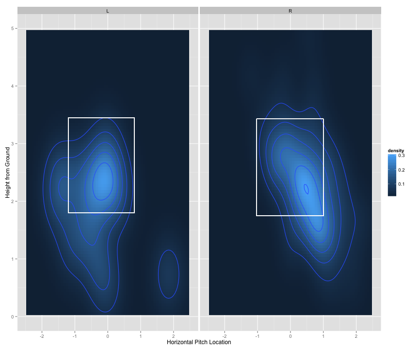
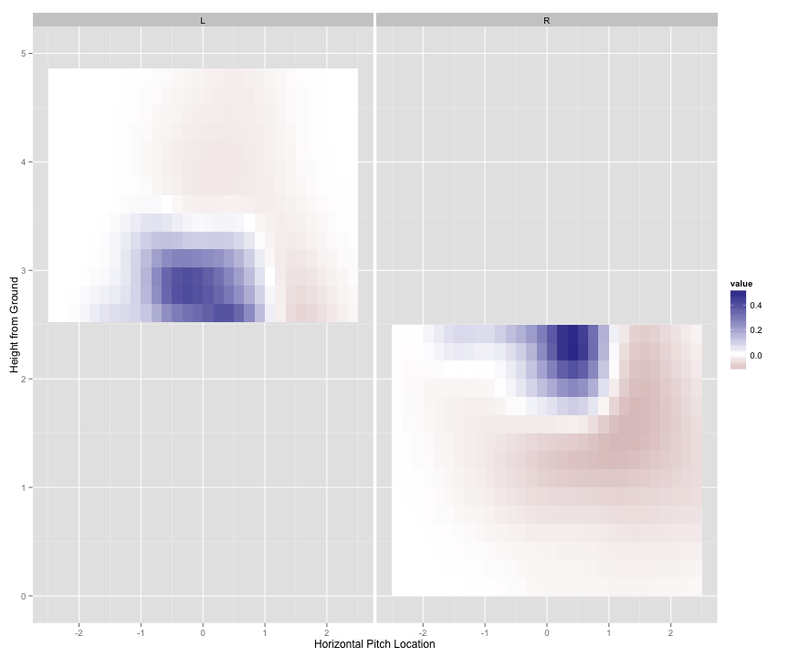

% pitchRx: Tools for Collecting and Analyzing Major League Baseball's (MLB) PITCHf/x Data
% Carson Sievert
% 5/23/2013

## Yu "Vishnu" Darvish

<div align="center">
  
</div>

## Automate all the things!

* __Goal__: dynamically recreate similar video snippets for _any_ MLB situation.

* __Partial Solution__: use my R package `pitchRx`!
1. Easily collect PITCHf/x data via `R` console
2. Convenient functionality for PITCHf/x animation (as well as other visualizations) 

* __Full Solution__: Somehow connect PITCHf/x data to MLB video?!?

## Easy access to PITCHf/x data


```r
library(pitchRx)
dat <- scrapeFX(start="2013-04-24", 
                end="2013-04-24")
atbats <- subset(dat$atbat, 
                 pitcher_name == "Yu Darvish")
pitches <- plyr::join(atbats, dat$pitch, 
                by=c("num", "url"), type="inner")
```


* `dat` is a list of two data.frames - `dat$atbat` and `dat$pitch` - that contain information on every atbat and pitch thrown on April 24th, 2013.

* `pitches` contains info on every pitch thrown by Yu Darvish on April 24th, 2013.

## Animation and batter stance

* By default, `pitchRx` calculates two aggregated strikezones. One for left handed batters and one for right handed batters.

* For this reason, it usually makes sense to facet plots by batter stance.

* The next slide is output from:


```r
animateFX(pitches, layer=list(theme_bw(),
                    coord_equal(),
                    facet_grid(.~stand)))
```


* Note that as the animation progresses, the pitches are being thrown directly towards you.

## `pitches` by stance (real time)

<div align = "left">
 <embed width="864" height="720" name="plugin" src="figure/ani.swf" type="application/x-shockwave-flash"> 
</div>


## Whoa, nelly!!!

<div align="center">
  
</div>

* Real time animations are __hard to digest__!

* Same with that many pitches...

## "Normalized" PITCHf/x

* Let's average over pitch types (to get a 'typical' flight path)


```r
ps<-ddply(pitches, c("pitch_type", "stand"), 
          summarize, x0=mean(x0), y0=55, 
          z0=mean(z0), vx0=mean(vx0), 
          vy0=mean(vy0), vz0=mean(vz0),
          ax=mean(ax), ay=mean(ay), az=mean(az))
ps$b_height <- "6-1" #estimate average batter height (for strikezones)
animateFX(ps, layer=list(theme_bw(), 
                         coord_equal(), 
                         facet_grid(.~stand)))
```


## 'Normalized' animation

<div align = "left">
 <embed width="864" height="720" name="plugin" src="figure/ani-norm.swf" type="application/x-shockwave-flash"> 
</div>


## WebGL Graphics


```r
RH <- subset(ps, stand=="R")
interactiveFX(RH)
```


* Output can be viewed [here](http://cpsievert.github.com/pitchRx/YuDarvishNorm):

## Strike-zone Densities

* Strike-zone densities are essentially the final frame of an animation. That is, they portray the horizontal and vertical location of the baseball as it crosses home plate.
* `strikeFX` provides a flexible framework for visualizing strike-zone densities.

## Remove Me!


```r
strikeFX(pitches, layer=facet_wrap(~stand))
```

 


## Remove Me!


```r
strikeFX(pitches, geom="tile", contour=TRUE, 
         layer=facet_wrap(~stand))
```

 


## Remove Me!


```r
strikeFX(pitches, geom="tile", density1=list(des="Called Strike"), 
    density2=list(des="Ball"), layer=facet_wrap(~stand))
```

 


## Remove Me!


```r
strikeFX(pitches, geom="subplot2d", fill="des")
```

 


## Want more??

1. [Comprehensive pitchRx demo page](http://cpsievert.github.com/pitchRx/demo/) (now included with CRAN package as R Markdown vignette)

2. [Shiny web application](http://glimmer.rstudio.com/cpsievert/pitchRx/)
  * Slick user interface to `strikeFX` and `animateFX`
  * Upload your own csv files!

3. I [occasionally](http://cpsievert.wordpress.com/) [blog](http://cpsievert.github.io/) about `pitchRx`.

## Special Thanks to:

#### This project wouldn't be possible without the help of these people/organizations. Thank you for your help and/or great work!!!

* Heike Hofmann (my major professor) [@heike_hh](https://twitter.com/heike_hh)
* Di Cook [@visnut](https://twitter.com/visnut/)
* Yihui Xie [@xieyihui](https://twitter.com/xieyihui)
* Ramnath Vaidyanathan [@ramnath_vaidya](https://twitter.com/ramnath_vaidya)
* RStudio [@rstudioapp](https://twitter.com/rstudioapp)
* Hadley Wickham [@hadleywickham](https://twitter.com/hadleywickham)
* Joe Cheng [@jcheng](https://twitter.com/jcheng)
* Winston Chang [@winston_chang](https://twitter.com/winston_chang)
* MLB Advanced Media [@mlbdotcom](https://twitter.com/mlbdotcom)
* Alan Nathan [@pobguy](https://twitter.com/pobguy)
* Mike Fast [@fastballs](https://twitter.com/fastballs)

## Questions???
