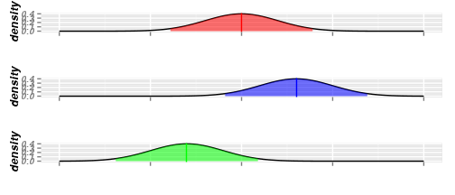

% Introduction to Confidence Intervals
% Carson Sievert
% 3/7/2013

## Re-Cap

1. Provided that I know the population mean and variance. I can specify the mean and variance of the sampling distribution of the sample mean: $\bar{X} \sim (\mu, \sigma^2/n)$.
 * Note that the shape of $\bar{X}$ will be at least approximately normal unless our population distribution is non-normal and $n < 30$.
2. With this information, I can find any proportion of the curve that I want, for example $P(\bar{X} < 5)$.
  * I can interpret this quantity as the probability the sample of size $n$ yields a sample mean lower than 5.
  
## Re-Cap (part 2)

3. I can also find any percentile(s) of interest.
 * For example, suppose $P(3 < \bar{X} < 5) =.95$
 * In this case, I know that there is a 95% chance of observing a sample mean between 3 and 5.

## Transitioning to C.I.'s

1. In reality, it is very rare that we know the population mean $\mu$. Most of statistics is _inference_. That is, we infer (or esimate) plausible values for $\mu$ based on observation(s) $\bar{x}$.

2. As a result, we really have no idea what the __true__ sampling distribution looks like!

3. However, it is helpful to remember that our samples are taken from the true distribution!!!

---

 

---

 

## Interpret the graphics

1. The red shading defines the middle 95% of the true sampling distribution. The solid red line is the value of $\mu$

2. The blue and green versions are similar, except we "pretend" that $\mu$ is the _observed_ sample mean $\bar{x}$.

3. Notice how both the blue and green shaded portions overlap with the solid red line ($\mu$). Thus, in both cases, it just so happens that the "95% confidence interval" contains $\mu$.

4. [Here](http://glimmer.rstudio.com/sazimme2/CIZ/) is another way of thinking of the same concept (repeated many times over).

